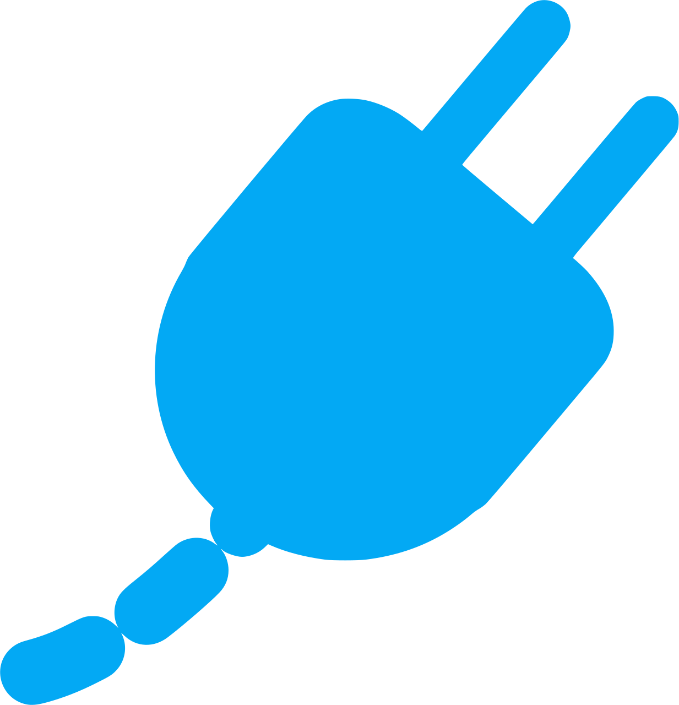

# PLUG
## ELECTRICITY FOR YOUR FRONTEND CODE BASE




## socket.config.js specification

```
{
  engins: {
    nodejs: {
      version: "10"
    }
    yarn: {
      version: "1.17.0"
    }
    lerna: {
    
    }
 }
 
}
```
